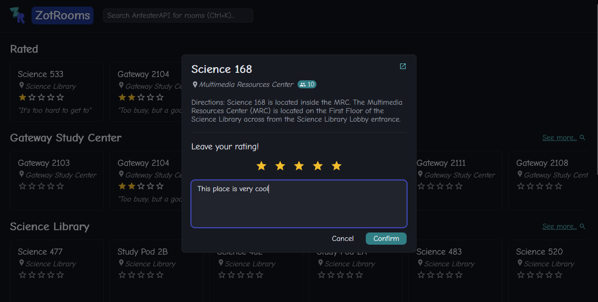

# ZotRooms

ZotRooms is a demo project for ICSSC's deployment workshop at IrvineHacks 2026. It lets you rate study rooms on campus.

## Running locally
1. Clone this repository: `git clone https://github.com/CadenLee2/zotrooms`
2. `npm install`
3. Set up a PostgreSQL database and configure the URL in your `.env` file (see [Configuration](#configuration))
4. `npm run dev` and visit <http://localhost:3000>

## Configuration
Copy `.env.example` into `.env`.

This project requires a PostgreSQL database to store data persistently. You'll have to set one up:
- Locally: install PostgreSQL and set up a database, or
- Cloud-hosted: use a platform like [Railway](https://railway.com?referralCode=NOW5I_) to make it easy
    - Sign up with your GitHub account
    - Create a PostgreSQL database
    - Go to Database -> Connect -> Public Network -> copy the connection URL

In `.env`, set `DATABASE_URL` to your database URL

## Deployment
To deploy via Railway:
- [Sign up](https://railway.com?referralCode=NOW5I_) with your GitHub account
- Configure access to your fork of this repository
- Edit the Variables -> `DATABASE_URL` to match what's in your local `.env` (note: this won't work if you ran your database locally)
- Click "Deploy"

Optionally, you can go to Settings -> Networking to generate a URL so friends can access the project!

## Stack
This project uses the following technologies:
- Next.js
- Backend
    - [Anteater API](https://icssc.link/about-anteaterapi)
    - PostgreSQL
- Frontend
    - Next.js
